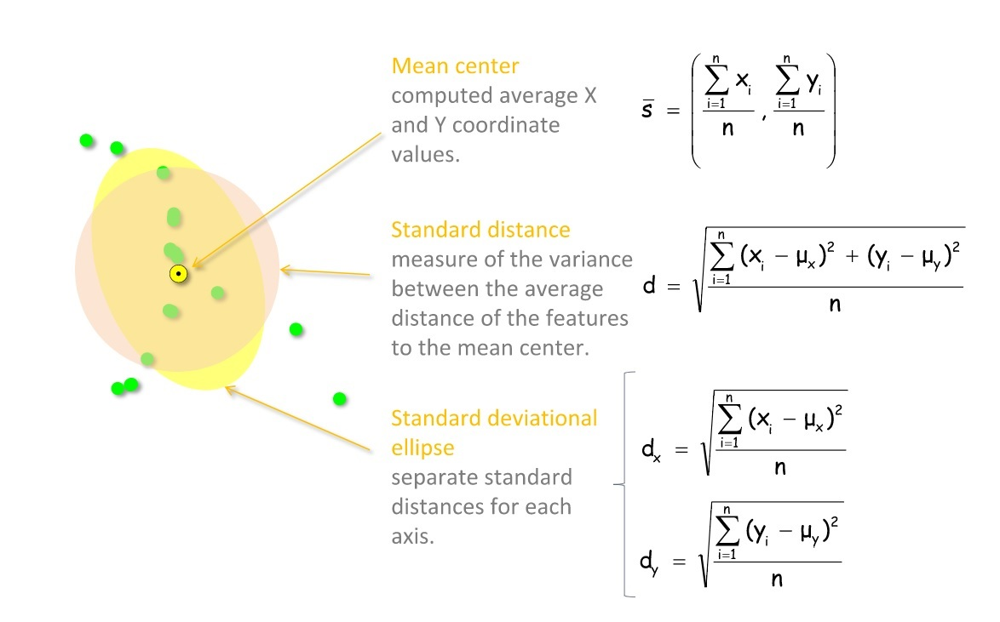
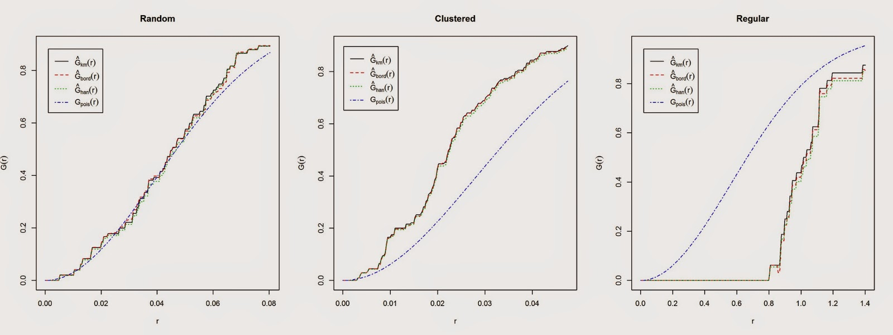

Los Modelos Espaciales Puntuales, fueron inicialmente implementados por botánicos y ecólogos, en la década de los 30 del siglo XX para determinar, la distribución espacial de los datos y sus causas en una especie determinada o para comparar si dos espíes estaban igualmente distribuidas. En la actualidad este tipo de análisis es empleado en muchos campos tales como la arqueología, la epidemiologia, marketing o la criminología. Por ejemplo, es posible estudiar si los caos de una enfermen dad determinada están distribuidos espacialmente.

Este tipo de análisis generalmente se lleva acabo con los siguientes propósitos: 	

1. Analizar la distribución que presentan los datos puntuales para determinar si están distribuidos aleatoriamente, es decir al azar y sin ningún modelo determine la distribución observada; están distribuidos regularmente, es decir están distribuidos de forma uniforme; o si están distribuidos formando clusters.

2.	Analizar la densidad espacial del fenómeno, es decir, el número de individuos o eventos por unidad de área.

3.	El ultimo objetivo es relativo a la comparación entre tipos de eventos, por ejemplo, comparar especies. 


#Introducción.
En este ejercicio analizaremos la distribución espacial de crímenes en la Ciudad de México, para este propósito emplearemos una base de datos generada por el portal CRIMEN POR TU RUMBO https://hoyodecrimen.com/.

#Cargar y limpiar datos.  

Como primera medida cargaremos los paquetes necesarios para este análisis. 
```{r message=FALSE, warning=FALSE}
library(sf)
library(sp)
library(mapview)
library(tidyverse)
library(plotrix)
library(spatstat)
library(maptools)
library(raster)
```


El conjunto de datos proporcionado por CRIMEN POR SU RUMBO  se encuentra en formato csv por lo cual usaremos `read.csv`,También cargaremos los polígonos de delegaciones.

```{r message=FALSE, warning=FALSE}
setwd("C:/Users/Rocket/Google Drive/1.Materias/Analisis_espacial/2_Analisis_puntos")
crimen<-read.csv("input/crime-lat-long.csv")
delega <- shapefile("input/DF_Delegaciones.shp")
```

Podemos ver la estructura del conjunto de datos simplemente usando la función `str`: 

```{r}
str(crimen)
```

Este conjunto de datos proporciona una serie de información útil sobre delitos: sus ubicaciones (longitud y latitud en grados y el tipo de delito. Para algunos incidentes, las coordenadas no se proporcionan, por lo tanto, antes de continuar, debemos eliminar los NA de los datos, adicionalmente por ahora solo nos concentramos en los delitos del año 2013

```{r}
summary(crimen$lat)
summary(crimen$long)
crimen<-crimen[!is.na(crimen$long)&!is.na(crimen$lat),]
crimen<-crimen[crimen$year==2013,]
```
Ahora procederemos a convertir nuestra tabla en un objeto espacial de la siguiente manera:
```{r}
coordinates(crimen)=~long+lat
projection(crimen)=projection(delega)

```
```{r}
plot(crimen,pch="+",cex=0.5,main="",col=crimen$crime)
plot(delega,add=T)
```


En este caso estaremos recurriendo constantemente a valores de distancias por lo cual proyectaremos a un sistema de coordenadas planas. 
```{r}
crimen_utm<-spTransform(crimen, CRS("+init=epsg:6369"))
delega_utm<-spTransform(delega, CRS("+init=epsg:6369"))
```

#Análisis exploratorio  
Una forma muy básica de análisis de patrones puntuales implica estadísticas de resumen tales como el centro medio, la distancia estándar y la elipse de desviación estándar.


En R podemos realizar este cálculo de la siguiente manera:        
```{r}
x_coord<-crimen_utm@coords[,1]
y_coord<-crimen_utm@coords[,2]
```
```{r}
mean_centerX<-mean(crimen_utm@coords[,1])
mean_centerY<-mean(crimen_utm@coords[,2])

standard_deviationX <- sd(x_coord)
standard_deviationY <- sd(y_coord)
```

```{r}
standard_distance <- sqrt(sum(((x_coord-mean_centerX)^2+(y_coord-mean_centerY)^2))/(nrow(crimen_utm)))

```
```{r}
plot(crimen_utm,pch="+",cex=0.05,main="")
plot(delega,add=T,cex=0.001)
points(mean_centerX,mean_centerY,col="red",pch=16)
draw.circle(mean_centerX,mean_centerY,radius=standard_distance,border="red",lwd=2)
```

El problema con la distancia estándar es que promedia la desviación estándar de las distancias para ambas coordenadas, por lo que no tiene en cuenta las posibles diferencias entre las dos dimensiones. Podemos tenerlos en cuenta al trazar una elipse, en lugar de un círculo, con los dos ejes iguales a las desviaciones estándar de 
las coordenadas X y Y.
```{r}
plot(crimen_utm,pch="+",cex=0.05,main="")
plot(delega,add=T,cex=0.001)
points(mean_centerX,mean_centerY,col="red",pch=16)
draw.ellipse(mean_centerX,mean_centerY,a=standard_deviationX,b=standard_deviationY,border="red",lwd=2)
```

Estas técnicas de análisis de patrones de puntos fueron populares antes de que las computadoras, ya que los cálculos manuales no son demasiado complicados, pero estas estadísticas de resumen son demasiado concisas y esconden información mucho más valiosa sobre el patrón observado. Se pueden usar métodos de análisis más potentes para explorar patrones de puntos. 

#Intensidad y densidad  
A partir de este punto nos concentraremos solo en los eventos de homicidios y removeremos los valores duplicados. 
```{r}
homicidios<-crimen_utm[crimen_utm$crime=="HOMICIDIO DOLOSO",]
homicidios <- remove.duplicates(homicidios)
```
Un patrón de puntos se define como una serie de eventos en un área determinada, o ventana, de observación. Por lo tanto, es extremadamente importante definir con precisión esta ventana. En *spatstat*, la función ``owin` se usa para establecer la ventana de observación. Sin embargo, la función estándar toma las coordenadas de un rectángulo o de un polígono de una matriz, y por lo tanto puede ser un poco difícil de usar. Afortunadamente, el paquete maptools proporciona una forma de transformar un `SpatialPolygons` en un objeto de clase `owin`, utilizando la función `as.owin`.
```{r}
w<-as(delega_utm, "owin")
```
Ahora podemos usar la función ppp, en spatstat, para crear el objeto de patrón de punto:

```{r}
homicidios.ppp <- ppp(x=homicidios@coords[,1],y=homicidios@coords[,2],window=w)
```
Ahora podemos calcular la intensidad de la siguiente manera:
```{r}
homicidios.ppp$n/sum(sapply(slot(delega_utm, "polygons"), slot, "area"))
```
El numerador es la cantidad de puntos en el objeto ppp; mientras que el denominador es la suma de las áreas de todos los polígonos. Para delitos relacionados con drogas, la intensidad promedio es de 5.33 × 10 ^ -7 por metro cuadrado, en el área de la ciudad de México.

La intensidad puede ser constante a través de la ventana de estudio, en ese caso en cada metro cuadrado encontraríamos la misma cantidad de puntos, y el proceso sería uniforme o homogéneo. Muy a menudo la intensidad no es constante y varía espacialmente a lo largo de la ventana de estudio, en ese caso el proceso no es homogéneo. Para procesos no homogéneos, necesitamos una forma de determinar la cantidad de variación espacial de la intensidad. Hay varias maneras de tratar este problema, un ejemplo es el conteo de cuadrantes, donde el área se divide en rectángulos y se cuenta el número de eventos en cada uno de ellos.

```{r}
q<-quadratcount(homicidios.ppp, nx = 8, ny = 8)
```
```{r}
plot(homicidios.ppp,pch=20, cols="grey70",cex=0.05,main="Homicidios")
plot(q,add=TRUE,col="red")
```
Esta función es buena para ciertos conjuntos de datos, pero en este caso no aporta mucho al análisis usar el conteo de cuadrantes, ya que las áreas que crea no tienen ningún significado en la realidad. Sería mucho más valioso extraer el número de crímenes por delegación, por ejemplo. Para hacer esto, necesitamos usar un ciclo e iterar a través de los polígonos.
```{r warning=FALSE}

Local.Intensity <- data.frame(Mun=factor(),Number=numeric())
for(i in unique(delega_utm$Name)){
  sub.pol <- delega_utm[delega_utm$Name==i,]
  sub.ppp <- ppp(x=homicidios.ppp$x,y=homicidios.ppp$y,window=as.owin(sub.pol))
  Local.Intensity <- rbind(Local.Intensity,data.frame(Mun=factor(i,levels=delega_utm$Name),Number=sub.ppp$n))
}
```
Podemos echar un vistazo a los resultados en una barra de barras con el siguiente código:

```{r}
colorScale <- color.scale(Local.Intensity[order(Local.Intensity[,2]),2],color.spec="rgb",extremes=c("green","red"),alpha=0.8)
barplot(Local.Intensity[order(Local.Intensity[,2]),2],names.arg=Local.Intensity[order(Local.Intensity[,2]),1],horiz=T,las=2,space=1,col=colorScale)

```
Otra forma en que podemos determinar la distribución espacial de la intensidad es mediante el uso de suavizado de kernel. Este método calcula la intensidad de forma continua en toda el área de estudio. Para realizar este análisis, necesitamos definir el ancho de banda de la estimación de densidad, que básicamente determina el área de influencia de la estimación. No hay una regla general para determinar el ancho de banda correcto; en términos generales, si h es demasiado pequeño, la estimación es demasiado ruidosa, mientras que si h es demasiado alta, la estimación puede pasar por alto elementos cruciales del patrón de puntos.


En spatstat, las funciones `bw.diggle`, `bw.ppl` y `bw.scott` se pueden usar para estimar el ancho de banda de acuerdo con los métodos de diferencia. Podemos probar cómo funcionan con nuestro conjunto de datos utilizando el siguiente código.

```{r}
sigma1<- bw.diggle(homicidios.ppp)
sigma2<- bw.ppl(homicidios.ppp)
sigma3<- bw.scott(homicidios.ppp)[1]
sigma4<- bw.scott(homicidios.ppp)[2]
```

```{r}
d1<-density.ppp(homicidios.ppp, sigma =sigma1,edge=T)
d2<-density.ppp(homicidios.ppp, sigma =sigma2,edge=T)
d3<-density.ppp(homicidios.ppp, sigma =sigma3,edge=T)
d4<-density.ppp(homicidios.ppp, sigma =sigma4,edge=T)
```

```{r}
plot(d1,main=paste("h =",round(sigma1,2)))
plot(d2,main=paste("h =",round(sigma2,2)))
plot(d3,main=paste("h =",round(sigma2,2)))
plot(d4,main=paste("h =",round(sigma2,2)))
```


#Aleatoriedad espacial 
Evaluar si un patrón puntual es aleatorio es un paso crucial del análisis. Si determinamos que el patrón es aleatorio, significa que cada punto es independiente el uno del otro y de cualquier otro factor. La aleatoriedad espacial completa implica que los eventos del proceso puntual tienen la misma probabilidad de ocurrir en todas las regiones de la ventana de estudio. En otras palabras, la ubicación de un punto no afecta la probabilidad de que se observe otro cerca, cada punto es completamente independiente de los demás.


En spatstat podemos determinar qué distribución tienen nuestros datos usando la función G, que calcula la distribución de las distancias entre cada evento y su vecino más cercano (Bivand et al., 2008). Según la curva generada por la función G, podemos determinar la distribución de nuestros datos. Para un mayor detalla sobre la función G y otras puede consultar https://mgimond.github.io/Spatial/point-pattern-analysis.html.



Estas son las curvas generadas por la función G para cada distribución. La línea azul es la función G calculada para un patrón de punto aleatorio espacial completo, por lo que en el primer caso, dado que los datos siguen más o menos la línea azul, el proceso es aleatorio. En el segundo caso, la línea calculada a partir de los datos está por encima de la línea azul, esto indica una distribución agrupada. Por el contrario, si la línea generada a partir de los datos está por debajo de la línea azul, el patrón de puntos es regular.

Podemos calcular el trazado de esta función para nuestros datos simplemente usando las siguientes instrucciones. 

```{r}
plot(Gest(homicidios.ppp),main="Homicidios")
```

